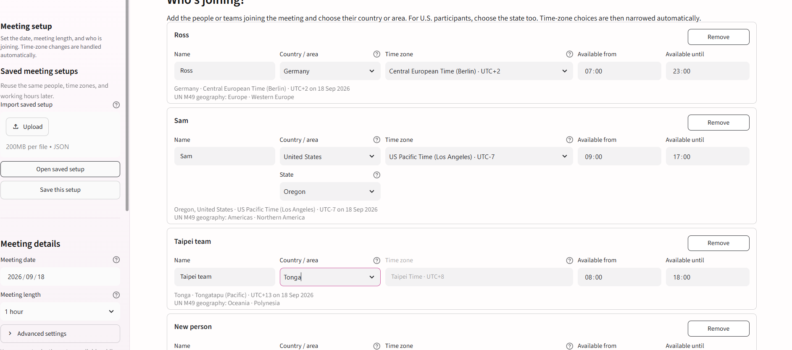

# Global Meeting Planner

**A Drapalski Consulting tool for coordinating international teams across time zones, working hours, and daylight-saving changes.**

Global Meeting Planner helps international teams identify practical meeting times without repeatedly converting time zones by hand. It combines local availability, date-specific UTC offsets, daylight-saving rules, and visual scheduling cues in one browser-based workflow.



## What it does

- Compares local working hours across countries and time zones
- Applies date-specific daylight-saving changes automatically
- Narrows U.S. time-zone choices by state
- Ranks practical meeting times across participants
- Visualizes business, shoulder, and sleep hours globally
- Saves and reloads portable meeting setups as JSON files
- Shows ISO alpha-3 country codes and UN M49 geographic context

## Why we built it

International work creates small coordination frictions that compound across teams. A meeting involving Europe, North America, and Asia should not require repeated manual UTC calculations.

This tool turns those calculations into a simple visual planning workflow.

## Live application

**Live app:** deployment link will be added after the Streamlit Community Cloud launch.

## About Drapalski Consulting

**Drapalski Consulting LLC** provides structured financial leadership, governance, analytics, and cross-border advisory support to businesses operating in complex environments.

Website: [www.drapal.ski](https://www.drapal.ski)

## Technology

Built with Python, Streamlit, Plotly, pandas, and the IANA time-zone database distributed through `tzdata`.

## Privacy

Scheduling information is not intentionally written by the application to its own persistent database. Current selections live in the active Streamlit session. A reusable setup is persisted only when the user chooses to download a JSON setup file.

## Run locally

```bash
python -m pip install -r requirements.txt
python -m streamlit run app.py
```

## Repository structure

```text
.
├── .github/
│   └── workflows/
│       └── python-check.yml
├── .streamlit/
│   └── config.toml
├── assets/
│   ├── drapalski_logo.png
│   └── preview.png
├── .gitignore
├── app.py
├── LICENSE.md
├── README.md
├── requirements.txt
└── sample_preset.json
```

## Use and rights

Copyright © 2026 Drapalski Consulting LLC. All rights reserved. See `LICENSE.md`.
